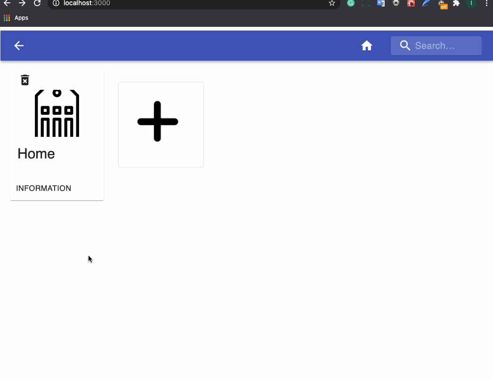
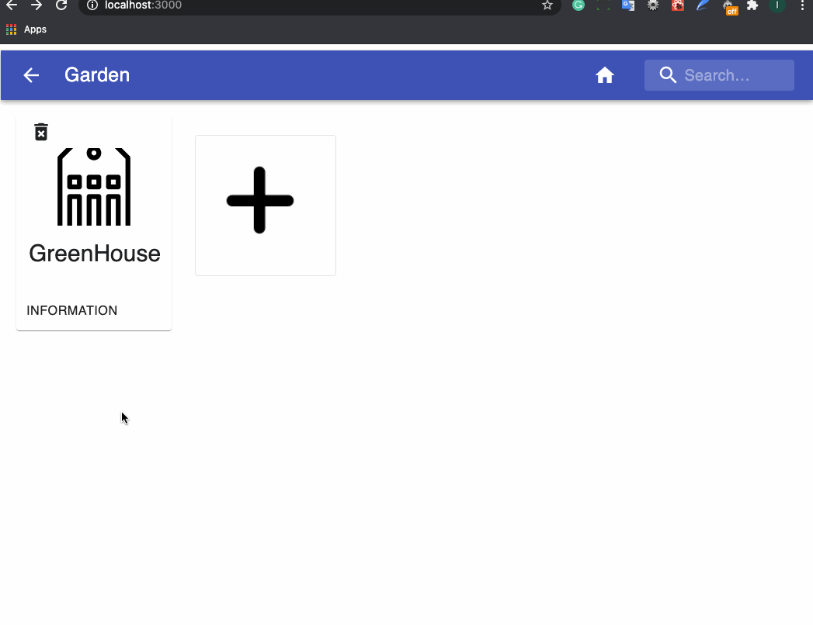
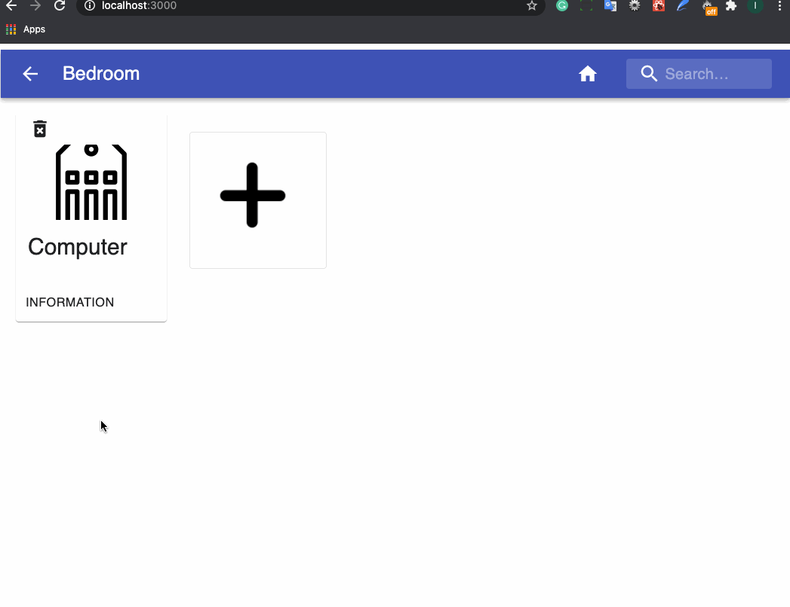
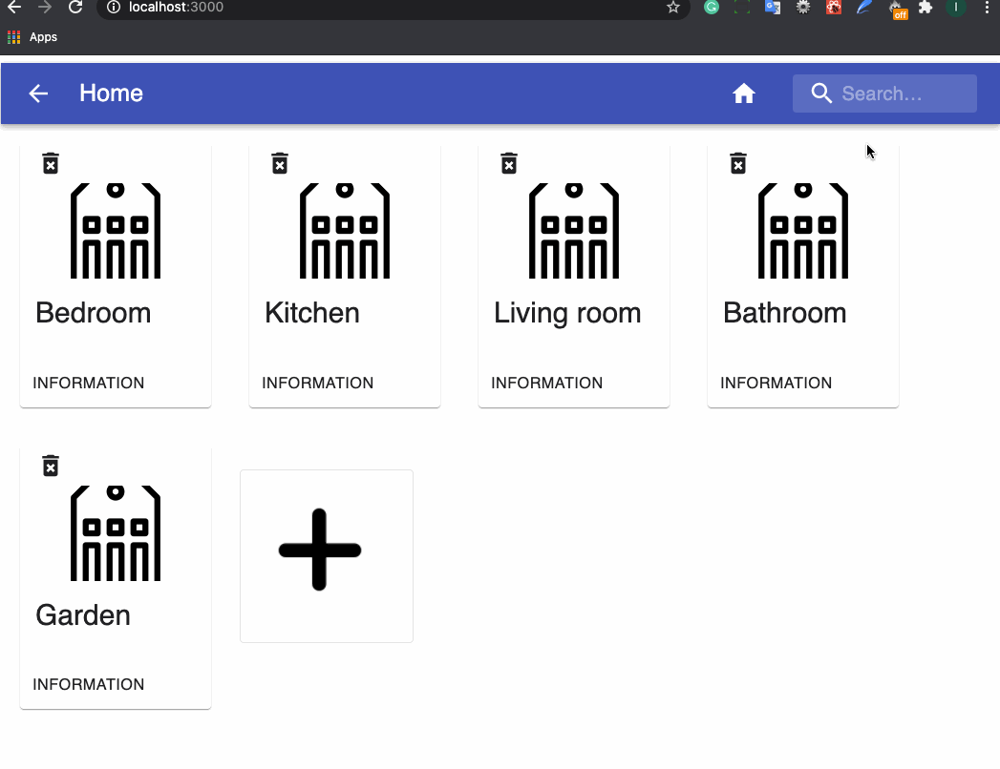

Version 1 is ready to go!

## Show items

## Go back

## Add Item

## Delete Item

## Search for Item

## Show Addtional Information

## Description
The 'app' folder was boostraped with create-react-app. It is the frontend of this program.

The 'server' folder is the backend of this program. Use Node.js express to build some apis.

